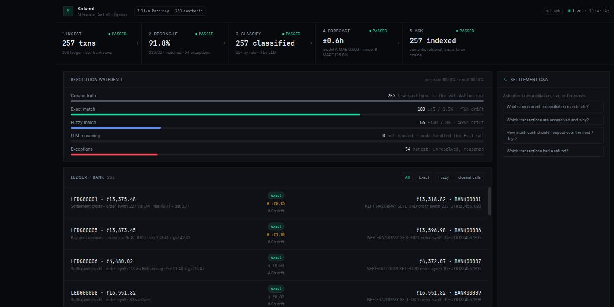

# Solvent

**AI Finance-Controller Pipeline** — built for the **Razorpay AI Buildathon, Track 04 (AI Finance Controller)**.

Solvent reconciles a merchant's settlements across three sources (a real Razorpay
test-mode feed, a synthetic internal ledger, a synthetic bank statement),
classifies every line for GST treatment, forecasts settlement timing and
deduction amounts with two trained regression models, and answers merchant
questions about their settlements through a retrieval-backed Q&A agent — all
surfaced through a Next.js "control room" dashboard.



## Track 04 alignment

Track 04 ("AI Finance Controller") asks for AI applied to financial control —
reconciliation, anomaly detection, reporting, or finance-control workflows —
and explicitly prioritizes **accuracy, traceability, explainability, and human
oversight**, since financial workflows require a high level of reliability.
Solvent is built around exactly those four:

| Requirement | How Solvent meets it |
|---|---|
| **Accuracy** | Reconciliation is scored against a held-out `ground_truth.json` the matching engine never sees (precision 1.00, recall 1.00 — see [`docs/metrics.md`](docs/metrics.md)). Forecaster MAE/MAPE are reported, including the honest weak spot (Model B's 126.83% MAPE), not just the flattering numbers. |
| **Traceability** | Every reconciliation match carries its tier, amount/timestamp drift, and both source rows. Every exception and every tax classification carries a `reasoning`/`explanation` string, surfaced end-to-end to the dashboard, not summarized away. |
| **Explainability** | The three-tier reconciliation cascade (exact → fuzzy → LLM) and the rule-first tax classifier make it visible *why* a line resolved the way it did — code handles the cascade first, and the LLM tier is exercised only where deterministic rules can't decide, then asked to explain itself. |
| **Human oversight** | Nothing is auto-closed. Every batch operation produces an honest, reasoned exception list for what it couldn't resolve — never hidden or force-matched — so a human reviews exactly the residual the system is unsure about. |

## Architecture

Six stages, strict dependency order — each depends on the previous stage's
validated output (see [`CLAUDE.md`](CLAUDE.md) for the full contract):

```
1. Ingestion         real Razorpay test-mode feed + synthetic ledger/bank, Groq-augmented narrations
2. Reconciliation    exact match → fuzzy match → LLM exception reasoning (residual only)
3. Tax matcher       rule-based classifier (majority) → LLM fallback (edge cases)
4. Forecaster        two trained scikit-learn LinearRegression models (days_to_settle, deduction_pct)
5. Q&A agent         semantic retrieval (local sentence-transformers embeddings) + Groq
6. Frontend          Next.js dashboard — pipeline rail, reconciliation, tax, forecast, Q&A
```

- **Single Groq entry point** (`backend/llm/groq_client.py`) — every LLM call in
  the codebase goes through one wrapper with retry/backoff and JSON
  extraction/repair built in; nothing else imports the Groq SDK directly.
- **Minimize LLM calls by design** — exact/fuzzy matching, the tax rules
  engine, and both forecaster models are pure code/ML. The LLM is used only
  for reconciliation's exception residual, the tax matcher's rule-fallback,
  and the Q&A agent.
- **Pluggable ingestion adapters** (`backend/ingestion/base.py`) — real
  Razorpay API, synthetic file reader, DB-backed reader, and a documented
  (not built) stub for a future PDF-statement adapter.
- **Postgres is the canonical store** (`backend/db.py`) for everything
  ingestion derives; raw `internal_ledger.json`/`bank_statement.json` stay as
  files, standing in for the external documents a real merchant's systems
  would hand over.

## Reproducing this locally

```bash
# 1. Postgres — create the role/db matching DATABASE_URL in .env.example
sudo -u postgres psql -c "CREATE USER solvent WITH PASSWORD 'solvent_dev_pw';"
sudo -u postgres psql -c "CREATE DATABASE solvent OWNER solvent;"

# 2. Backend
python3 -m venv .venv && source .venv/bin/activate
pip install -r backend/requirements.txt
cp .env.example backend/.env   # fill in RAZORPAY_KEY_ID/SECRET and GROQ_API_KEY

python -m backend.ingestion.run_ingestion       # stage 1 — also creates tables (db.init_db)
python -m backend.reconciliation.run_reconciliation  # stage 2 — reports precision/recall/match rate
python -m backend.tax_matcher.run_tax_matcher   # stage 3
python -m backend.forecaster.train              # stage 4 — reports MAE/MAPE for both models
python -m backend.qa_agent.run_qa "What's my current match rate?"  # stage 5 (also indexes embeddings)

uvicorn backend.api:app --reload --port 8000    # serves stages 2-5 to the frontend

# 3. Frontend (separate terminal)
cd frontend && npm install
# frontend/.env.local sets NEXT_PUBLIC_API_BASE_URL — defaults to
# http://localhost:8000 (lib/api.ts) if you don't set it at all
npm run dev                 # http://localhost:3000
```

Q&A embeddings are indexed **lazily** on first use (first `/api/qa` call or
`run_qa` invocation), not during ingestion — the dashboard's "Ask" stage gate
shows `pending` until that first call happens.

Regenerate the forecaster diagnostic plots any time after retraining:
```bash
python -m backend.forecaster.plot_diagnostics
```

## Metrics & diagnostics

- [`docs/metrics.md`](docs/metrics.md) — reconciliation precision/recall/match
  rate against ground truth, tier breakdown, and forecaster MAE/MAPE.
- [`docs/forecaster_diagnostics.md`](docs/forecaster_diagnostics.md) — learning
  curves, predicted-vs-actual, and residual plots for both trained models,
  plus the root-cause analysis of *why* Model B's MAPE is high.

Headline numbers (see the linked docs for full detail and honest caveats):

| | |
|---|---|
| Reconciliation match rate | 91.8% (236/257), precision 1.00, recall 1.00 |
| Resolved by code (exact + fuzzy) | 236/236 matches — 0 needed the LLM tier |
| Honest exceptions | 54 (missing counterpart / likely duplicate — never hidden) |
| Model A (`days_to_settle`) | MAE 0.5951 days, MAPE 30.3% |
| Model B (`deduction_pct`) | MAE 0.0316, MAPE 126.83% (flagged — see diagnostics doc) |

**Both forecaster models are plain `sklearn.LinearRegression`, fit via the
closed-form solver — there is no training loop and therefore no loss-vs-epoch
curve.** `docs/forecaster_diagnostics.md` explains this and plots the honest
substitute (learning curves over training-set size, not iterations).

## What broke, and how it was recovered

Two real failures hit during this build, both still visible in the code as
the fix + a comment explaining why, per this project's "no hidden problems"
ethos:

1. **`pandas` 3.x silently broke the forecaster's feature pipeline.**
   Upgrading pandas broke `scikit-learn`'s `ColumnTransformer` with an
   `AttributeError` on `feature_names_in_` deep inside model training — not
   an obvious pandas-facing error. Root cause was a breaking change in how
   pandas 3.x's dtype backend interacts with scikit-learn 1.9's column-name
   validation. **Fix:** pinned `pandas<3` in `backend/requirements.txt` with
   the reason recorded inline, rather than chasing the incompatibility
   upstream.

2. **A SQLAlchemy implementation detail silently corrupted feature names
   going into the forecaster.** `dict(row._mapping)` on a SQLAlchemy result
   row looks like it produces plain `str` keys, but `RowMapping` actually
   keys by its internal `quoted_name` type (a `str` subclass). That leaked
   into the pandas DataFrames built from Postgres reads and broke a *strict
   type-identity* check inside scikit-learn's `ColumnTransformer` +
   `FunctionTransformer` feature-name validation — again failing inside
   model training, several layers away from the actual cause. **Fix:**
   `backend/db.py`'s `_fetch_all()` now casts every key to plain `str` at
   the one place all reads pass through, so the SQLAlchemy-internal type
   never leaks past the storage layer again.

Both are the kind of failure that's easy to chase in the wrong module (an
sklearn stack trace pointing nowhere near the real cause); the fix in both
cases was tracing the type/version mismatch back to its actual source and
containing it at the boundary, rather than working around the symptom.

## Security posture

Honest, as-is — this runs locally for a hackathon demo, not in production.

**In place:**
- CORS locked to `http://localhost:3000` (`backend/api.py`).
- Zero SQL-injection surface — every query goes through SQLAlchemy Core
  `Table`/`select`/`insert`/`delete`; the only raw `text()` call is a
  hardcoded `SELECT 1` healthcheck.
- No `eval`/`exec`/`pickle`/`subprocess` anywhere. Groq responses are only
  ever `json.loads`-parsed with regex repair — LLM output is never executed.
- Secrets never committed — `backend/.env` and `frontend/.env.local` are
  gitignored; `.env.example` ships blank placeholders only.
- No `dangerouslySetInnerHTML` anywhere in the frontend — all backend- and
  LLM-sourced strings (Q&A answers, tax reasoning, exception explanations)
  render through plain JSX, which React auto-escapes.

**Known gaps, documented rather than hidden:**
- **No authentication or authorization on any endpoint** — acceptable for a
  local demo, would need auth + rate limiting before any real deployment
  (in particular, `/api/qa` triggers a billed Groq call per request).
- `allow_methods=["*"]` / `allow_headers=["*"]` in CORS are broader than the
  app needs; origin restriction is the meaningful control here, but scoping
  these tighter would be better practice.
- `limit` query params on `/api/reconciliation/matches` and
  `/api/tax/classifications` are uncapped — low real risk at ~257 rows,
  worth bounding if the dataset grows.
- Backend dependencies are almost entirely unpinned (only `pandas<3` is
  pinned) — fine short-term, a lockfile would help for anything longer-lived.

## Frontend

A dark "audit terminal" control room rather than a generic SaaS card stack —
the page structure mirrors the pipeline itself:

- **Pipeline rail** — five stages (Ingest → Reconcile → Classify → Forecast →
  Ask), each with a live headline figure and gate status.
- **Resolution waterfall** — the exact/fuzzy/LLM tier cascade, including the
  `0` LLM rung rendered explicitly ("not needed — code handled the full
  set"), not silently dropped.
- **Ledger ⇄ Bank** — a two-sided match viewer showing both source rows,
  narrations, and the fee/GST arithmetic that closes each match, filterable
  by tier and sortable by drift.
- **Exception ledger, forecast panel (with model provenance), tax ledger
  (click-to-expand real per-transaction reasoning)**.
- **Ask rail** — the Q&A agent docked as a terminal-style transcript
  (⌘K to focus), instead of a bottom-of-page chat widget.

### Ideas for a further pass (not yet built)

- **Command palette (⌘K) as a real overlay** rather than just focusing the
  docked input — a modal with fuzzy-searchable quick actions (jump to a
  txn_id, filter exceptions by reason, re-run a forecast anchor date).
- **Deep-linkable drill-down** — clicking a ledger⇄bank pair or an exception
  row could open a detail panel showing the full joined settlement record
  (base transaction + tax classification + forecast prediction) via the
  existing `find_transaction_by_order_id`/`load_settlement_records` backend
  helpers, which already build this object but currently only feed the LLM.
- **Sparkline per pipeline-rail stage** — e.g. match rate or exception count
  over the last N pipeline runs, once run history is persisted (currently
  each run full-refreshes, so there's no history to chart yet).
- **Citations in Q&A answers** — `qa_agent/retriever.py`'s semantic search
  already scores and ranks records; returning the top matched `txn_id`s
  alongside the answer would let the Ask rail show "based on TXN00227,
  TXN00085…" instead of an unattributed prose answer.
- **A11y pass** — the dashboard is dense and mouse/color-driven (tier badges,
  waterfall bars); keyboard navigation through the ledger⇄bank list and
  exception table, plus non-color tier/reason indicators, would make it
  usable without relying on the accent palette.
- **Virtualized lists** — `Ledger ⇄ Bank` and the exception table render
  their full page of rows directly; fine at ~257 rows, would want windowing
  (e.g. `react-window`) if the dataset grows meaningfully past a demo size.

## Repo layout

```
Solvent/
  backend/
    ingestion/         # adapters, synthetic generator, ground_truth.json
    reconciliation/    # exact/fuzzy match, LLM exception reasoning, validation
    tax_matcher/       # rule engine + LLM fallback
    forecaster/         # Model A/B training, prediction, diagnostic plots
    qa_agent/            # semantic retrieval + Groq-backed Q&A
    llm/                 # single shared Groq wrapper
    data/                # raw/processed data, ground_truth.json (gitignored)
    tests/
    api.py               # FastAPI app — thin HTTP layer, no business logic
    db.py                # Postgres schema + load/save helpers
  frontend/
    app/                 # Next.js app router — single dashboard page
    components/          # pipeline rail, ledger/bank pairs, forecast, Q&A rail, ui/
    lib/                  # typed API client, format/cn helpers
  docs/
    metrics.md            # reconciliation + forecaster validation numbers
    forecaster_diagnostics.md  # learning curves, residuals, root-cause analysis
    figures/               # generated plots + dashboard screenshot
  CLAUDE.md               # full architecture contract
  .env.example
```

## Status

Build proceeds stage by stage per the dependency order above; validation
numbers for reconciliation and the forecaster are reported before advancing
— see [`docs/metrics.md`](docs/metrics.md) and
[`docs/forecaster_diagnostics.md`](docs/forecaster_diagnostics.md) for the
latest recorded numbers, and `git log` for build history.
