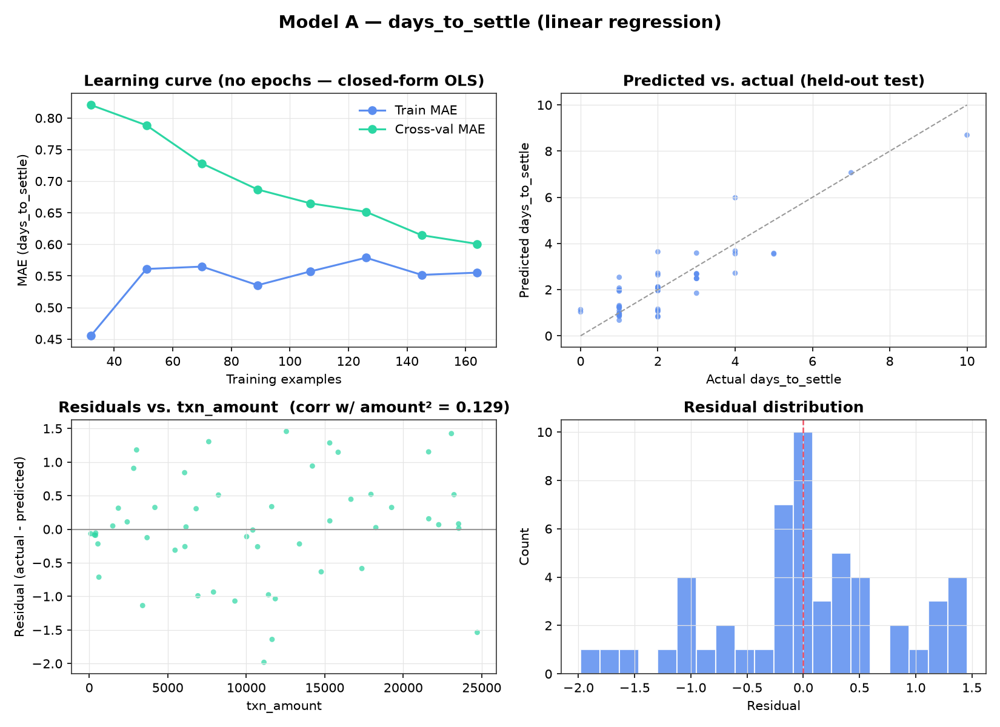
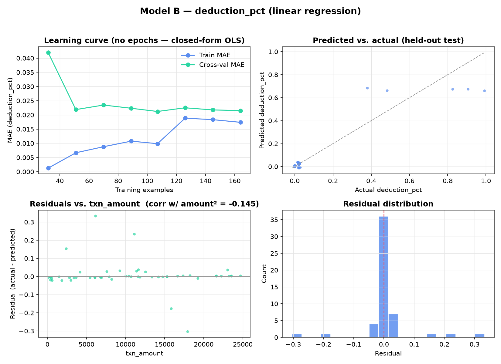

# Forecaster diagnostics

Generated by: `python -m backend.forecaster.plot_diagnostics`
(analysis-only script — not imported by `train.py`, `predict.py`, or `api.py`;
regenerate any time after retraining with `python -m backend.forecaster.train`)

## Why there's no loss-vs-epoch curve

Both Model A (`days_to_settle`) and Model B (`deduction_pct`) are plain
scikit-learn `LinearRegression` (see `backend/forecaster/features.py`), fit via
the closed-form normal-equation/SVD solver. There is no gradient descent, no
epochs, and therefore nothing to plot on a loss-vs-iteration axis — a model
this simple converges in one step. Rather than fabricate an epoch axis that
doesn't exist, this doc reports the honest diagnostic equivalents:

1. **Learning curve** — held-out MAE as a function of *training-set size*
   (5-fold CV, 8 points from 20% to 100% of the training split). This is the
   real analogue of a loss curve for a closed-form model: it shows whether
   more data would help, and whether train/validation error have converged.
2. **Predicted vs. actual** on the untouched test split.
3. **Residuals vs. `txn_amount`** — the same curvature diagnostic
   `train.py`'s `_has_curvature()` already computes a correlation for
   (`corr(residuals, txn_amount²)`); this plots it instead of just the number.
4. **Residual distribution.**

All four reuse the exact `train_test_split(random_state=42, test_size=0.2)`
and `build_pipeline(...)` from `train.py`, so the numbers here are
reproducible against `docs/metrics.md`.

## Model A — `days_to_settle`



- Learning curve: cross-val MAE falls from ~0.82 days at 20% of the training
  data to ~0.60 days at 100% — still trending down at the full 205-row
  training set, i.e. **more historical settlements would likely improve this
  model further**; it hasn't plateaued.
- Train MAE (~0.55d) and cross-val MAE (~0.60d) sit close together — no
  meaningful overfitting gap.
- Predicted-vs-actual tracks the diagonal reasonably for `days_to_settle` in
  the 0–4 day range (most of the dataset); the model under-predicts the rare
  slow settlements (actual 7, 10 days → predicted ~7.1, ~8.7 — closer than it
  looks at a glance, but this is where a linear model's limited flexibility
  shows most).
- Residuals-vs-amount correlation is 0.129 (below `train.py`'s own 0.15
  curvature threshold) — **consistent with the training run's decision not to
  fit the degree-2 polynomial variant**: there isn't a strong enough
  txn_amount-driven curvature to justify it.

## Model B — `deduction_pct`



- `deduction_pct` is **effectively bimodal in the underlying data**:
  `corr(deduction_pct, had_refund) = 0.95`. Non-refunded transactions
  (237 of 257) sit tightly between 0.01–0.03 (ordinary gateway-fee
  deduction); refunded transactions (20 of 257) jump to 0.68–0.99 (the refund
  consumes most of the settlement). A single linear model is being asked to
  fit what is functionally two different regimes with one coefficient set.
- This is exactly what the predicted-vs-actual panel shows: predictions
  cluster near ~0.00 (non-refund) and ~0.65–0.68 (refund) rather than
  tracking the true spread within the refund group (which runs up to 0.99) —
  the model has correctly learned that `had_refund` is the dominant signal,
  but a single linear coefficient on it can't also capture the wide variance
  *within* the refunded group.
- **This directly explains Model B's 126.83% MAPE** (`docs/metrics.md`): MAE
  is small in absolute terms (±0.0316 of a 0–1 fraction) because 237 of 257
  rows are non-refund and easy, but MAPE is dominated by percentage error on
  the near-zero true values and by underestimating the high end of the
  refund cluster.
- Residuals-vs-amount correlation is -0.145 — again below the 0.15
  threshold, so no polynomial variant was attempted, correctly per the
  project's curvature rule (the real structure here is bimodality driven by
  `had_refund`, not txn_amount curvature — a degree-2 term on amount wouldn't
  have fixed this).
- **Honest implication for a future iteration**: an interaction term or a
  small two-regime model (linear conditional on `had_refund`) would likely
  cut Model B's MAPE substantially without needing anything beyond the
  project's "pure supervised regression" constraint — noted here as a
  finding, not implemented, since `CLAUDE.md` scopes this stage to a
  linear/polynomial baseline contest.

## Reproducing

```bash
source .venv/bin/activate
python -m backend.forecaster.train              # retrain + persist metrics (Postgres)
python -m backend.forecaster.plot_diagnostics    # regenerate the PNGs above
```
