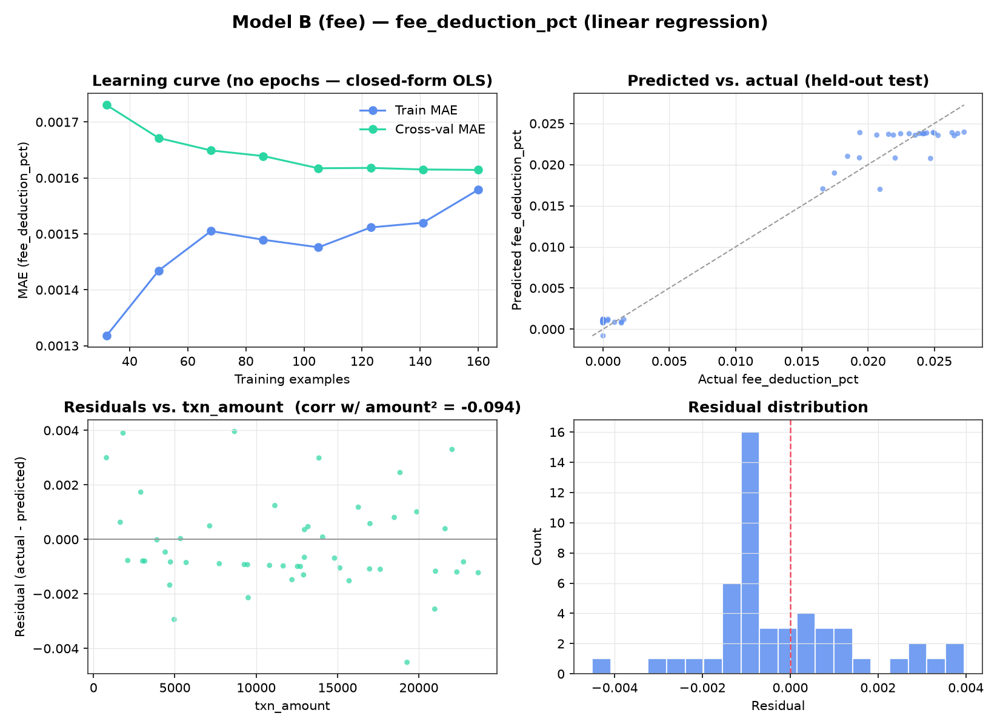
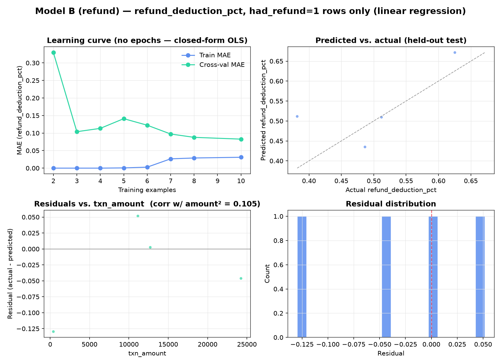

# Forecaster diagnostics

Generated by: `python -m backend.forecaster.plot_diagnostics`
(analysis-only script - not imported by `train.py`, `predict.py`, or `api.py`;
regenerate any time after retraining with `python -m backend.forecaster.train`)

## Why there's no loss-vs-epoch curve

Model A (`days_to_settle`) and both Model B submodels (`fee_deduction_pct`,
`refund_deduction_pct`) are plain scikit-learn `LinearRegression` (see
`backend/forecaster/features.py`), fit via the closed-form normal-equation/SVD
solver. There is no gradient descent, no epochs, and therefore nothing to plot
on a loss-vs-iteration axis - a model this simple converges in one step.
Rather than fabricate an epoch axis that doesn't exist, this doc reports the
honest diagnostic equivalents:

1. **Learning curve** - held-out MAE as a function of *training-set size*
   (5-fold CV, 8 points from 20% to 100% of the training split). This is the
   real analogue of a loss curve for a closed-form model: it shows whether
   more data would help, and whether train/validation error have converged.
2. **Predicted vs. actual** on the untouched test split.
3. **Residuals vs. `txn_amount`** - the same curvature diagnostic
   `train.py`'s `_has_curvature()` already computes a correlation for
   (`corr(residuals, txn_amount²)`); this plots it instead of just the number.
4. **Residual distribution.**

All three reuse the exact `train_test_split(random_state=42, test_size=0.2)`
and `build_pipeline(...)` from `train.py`, so the numbers here are
reproducible against `docs/metrics.md`.

## Model A - `days_to_settle`


- Learning curve: cross-val MAE ends at ~0.63 days at the full 200-row
  training set - still close to train MAE (~0.57 days), no meaningful
  overfitting gap, consistent with a well-specified linear fit.
- Residuals-vs-amount correlation is -0.086 (below `train.py`'s own 0.15
  curvature threshold) - consistent with the training run's decision not to
  fit the degree-2 polynomial variant.

## Model B - now split into `fee_deduction_pct` + `refund_deduction_pct`

**The original single Model B (MAE 0.0316, MAPE 126.83%) has been retired.**
The root cause, diagnosed here previously and now fixed: `deduction_pct` is
**effectively bimodal in the underlying data** (`corr(deduction_pct,
had_refund) = 0.95`). Non-refunded transactions (~92% of the data) sit
tightly between 0.01–0.03 (ordinary gateway-fee deduction); refunded
transactions (~8%) jump to 0.68–0.99 (the refund consumes most of the
settlement). One linear model with one coefficient set can't represent both
regimes at once - it was forced to average across them, which is exactly what
drove the 126.83% MAPE (small absolute error near zero becomes huge percentage
error, and the model couldn't track the wide spread within the refund cluster
either).

**Fix**: split into two additive linear models - the fix this document
previously flagged as a future iteration (a small two-regime model, linear
conditional on `had_refund`) is now implemented, per CLAUDE.md's originally
scoped optional refinement, now required.

### Model B (fee) - `fee_deduction_pct`, all transactions



- Trained on all 250 rows (n_train=200, n_test=50). This target - gateway fee
  + GST-on-fee, as a fraction of amount - has no refund-driven bimodality at
  all, so a single linear model fits it cleanly: MAE 0.0013, MAPE 23.41%.
- Residuals-vs-amount correlation is -0.094 - below the curvature threshold,
  no polynomial variant fit.
- The learning curve shows train and cross-val MAE both flat near ~0.0016
  from early in the training-size sweep - this target is easy for a linear
  model once it isn't also being asked to absorb the refund cluster.

### Model B (refund) - `refund_deduction_pct`, had_refund=1 rows only



- Trained *only* on the ~8% of transactions with `had_refund=1` - 14 train
  rows, 3 test rows. This is a genuinely small sample (refunds are rare by
  construction in the synthetic generator), so these diagnostics have wide
  uncertainty; read them as directional, not tightly confident.
- MAE 0.0519, MAPE 13.85% on this small test set - a real improvement over
  asking one model to represent this cluster *and* the non-refund cluster
  simultaneously, because the model's few training examples are now spent
  entirely on learning the refund-magnitude relationship instead of also
  having to learn where the 0/nonzero boundary is.
- Curvature was detected (residuals correlate with `txn_amount²` at 0.105,
  computed on a 14-row training set) - a degree-2 polynomial variant was
  fit but didn't improve on held-out MAE (0.0542 vs. 0.0519), so the linear
  baseline was kept. With this few rows, a curvature signal this close to
  the 0.15 threshold is more likely sample noise than real structure.

### Combined: `total_deduction_pct = fee_deduction_pct + refund_deduction_pct`

Evaluated on the full 50-row test split by combining both submodels'
predictions (refund submodel gated to 0 when `had_refund=0`, matching
`predict.py`'s inference-time logic) and comparing against the original
`deduction_pct` column - the same held-out rows and the same target the old
single Model B was scored on, so this is a direct comparison:

| | Old single Model B | New combined (fee + refund) |
|---|---|---|
| MAE | 0.0316 | **0.0037** (8.5x lower) |
| MAPE | 126.83% | **20.13%** (6.3x lower) |

The split fixed what it was diagnosed to fix: neither submodel has to
represent both regimes any more, so both the absolute and percentage error
dropped substantially on the same held-out evaluation.

## Reproducing

```bash
source .venv/bin/activate
python -m backend.forecaster.train              # retrain + persist metrics (Postgres)
python -m backend.forecaster.plot_diagnostics    # regenerate the PNGs above
```
